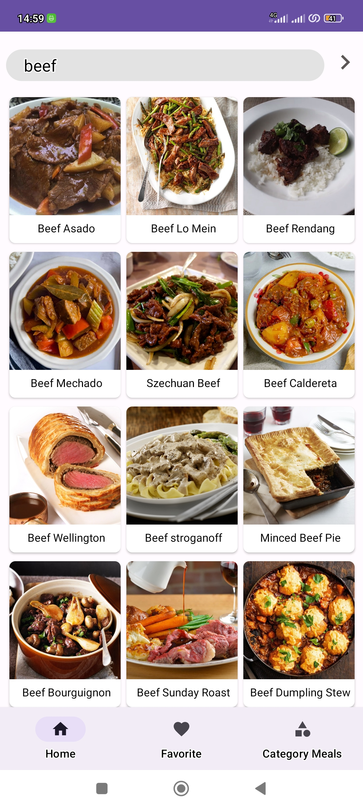

# Recipe! :food:

## DESCRIPTION

This is an Engaging Android Mobile Application for Culinary Enthusiasts. Experience the culinary exploration with our immersive Recipe Android mobile application. Immerse yourself in a world of flavors and culinary creativity as you embark on a journey through this crafted recipe app.

#### Screenshots

<p align="center">



<p>

## FEATURES

This Application allows users to explore an extensive collection of recipes while offering the convenient functionality to curate a personalized list of their most cherished culinary creations.

- **Comprehensive Recipe Insights:** Explore an extensive collection of recipes with detailed insights into ingredients and instructions.

- **Favorites:** Curate your personal collection of favorite recipes for easy access.

- **Video Tutorials:** Access video tutorials for recipes, providing visual guides for each step.

- **Offline Access:** Enjoy seamless access to your saved recipes, even without an internet connection.

- **Search Functionality:** Effortlessly find recipes using the search feature.

<p align="center">
<video width="250" src="Spec.md/video.mp4" alt="video"></video>
<p>

## PRE-REQUISITES.

A couple of things to get you started:

1. Ensure you have [Kotlin](https://kotlinlang.org/) installed

A simple way to install Kotlin is using [sdkman](https://sdkman.io/).

Simply follow the instructions to have _sdkman_ installed and install Kotlin:

```bash
sdk install kotlin
```

2. [Gradle](https://gradle.org/)

Gradle is used as a build automation tool and can be installed with sdkman:

```bash
sdk install gradle
```

3. [Android SDK](https://developer.android.com/studio/)

Android SDK used to provide all the necessary developer tools to build, test, and debug apps for Android in Windows, Mac or Linux.

4. [Android Build Tools](https://developer.android.com/studio/releases/build-tools)

Android SDK build tools used to debug, build, run and test an Android application.


## TECHNOLOGIES USED:

1. **[Retrofit](https://square.github.io/retrofit/)**
**Retrofit is a third party library used for sending and receiving HTTP-based network requests.**
2. **[Kotlin](https://kotlinlang.org/)**

**source language.**

3. **[Gradle](https://gradle.org/)**

**For dependency management and running tasks.**

4. **[Android SDK](https://developer.android.com/studio/)**

**For providing all the necessary developer tools to build, test, and debug Android applications on Windows, Mac or Linux.**

5. **[Android Build Tools](https://developer.android.com/studio/releases/build-tools)**

**For debugging, building, running and testing an Android applications.**

6. **[Themealdb](https://www.themealdb.com/api.php)**

The Meal DB is a comprehensive platform that delivers swift, dependable, and consolidated data APIs, catering to culinary enthusiasts and their exploration of diverse recipes.

The Meal DB API serves as a pivotal tool for fetching an array of recipe details, organized by various criteria including ingredients and meal categories. This data empowers users to seamlessly access and appreciate an extensive range of culinary creations.

7. **[Room database](https://developer.android.com/training/data-storage/room)**

**Was used to save users favorite meals recipes**

Room Database is a **SQL database**. It is a powerful tool for managing local data in Android apps.


## LIBRARIES TO NOTE.

1. **[Room Database](https://github.com/google/gson)**

- ** Room Database is a powerful tool for managing local data in Android apps.**

2. **[Retrofit](https://square.github.io/retrofit/)**

- Retrofit is a third party library used for sending and receiving HTTP-based network requests.

3. **[Glide](https://github.com/square/glide)**

- Picasso was used to display recipe photos.

- **Glide** is an image library for **Android**.It caters to image loading and processing. It simplifies the process of displaying images from external locations


## **SETUP/INSTALLATION!**


1. You will need **Internet connection**.

2. You need to get into the **themealdb**.

Link:-> ```https://github.com/tonnymuchui/RecipeApp```

3. From there you can access **RecipeApp**.

4. **Clone** the project.

5. **get into project folder** (cd into project).

6. If you have all the **Pre-requisites**

7. Open your **Android Studio Editor and run the Application**.


## How to contribute

All contributions are welcome, from code to documentation to graphics to design suggestions to bug reports. Please use GitHub to its fullest. Whatever you have to offer, we can use it!


## Support & Contact

- Mobile number: (+254) 721270949

- Email Address: tonykanyingah@gmail.com

- github-username: [tonnymuchui](https://github.com/tonnymuchui)

## LICENSE

This project is licensed under the **MIT License** - see the [LICENSE](LICENSE) file for details.